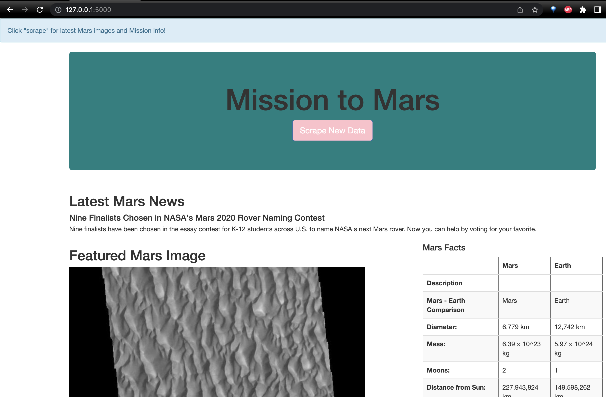

# Mission-to-Mars


## Purpose
The purpose of this project is to build a Web App that will :

1. Scrape several websites for the most recent Mars data. 

2. Store the extracted data in a NoSQL database.

3. Then create a frontend with Bootstrap to display the findings.


## Software

- Python 3.7
- splinter 0.14.0
- webdriver-manager 3.3.0
- Flask 1.1.2
- Flask-PyMongo 2.3.0
- BeautifulSoup (bs4) 0.0.1
- html5lib 1.1
- lxml 4.6.3
- VS Code

## Install and Run Flask app

- Install instructions coming soon!


## Results
The Flask aaplication scraped text and images successfully form the sites. Then, stored the image urls and text in MongoDB.

```
//Verified the scrape results stored with db.mars.find()
```


## Challenges
- The project had issues with dependencies being stored on the wrong vitual environment PATH. 
- This caused the application to be unable to run from VS Code terminal.
- The misplaced dependency files in the `flask` folder also caused the builtin git extenions to stop tracking the local version changes.
- I confirmed that the remote repo did not have the misplaced dependency files.
- Resolution: 
    1. Deleted the dependencie files inn the local repo.
    2. Copied remaining application files with new changes to a temporary directory
    3. Nuked the local repo.
    4. Ran `git clone ...' to revert to the working copy 
    5. Copied the flask directory from the temporary directory and pasted it into the cloned repo (promoted an option to replace the old file).
    This is called "the neuclear option" for a reason. Be mindful when installing tools while in a virtual environment. For instance, when using Anconda, remember to use `conda install` instead of `pip` to access dependencies  while working in your Anaconda environment. 
